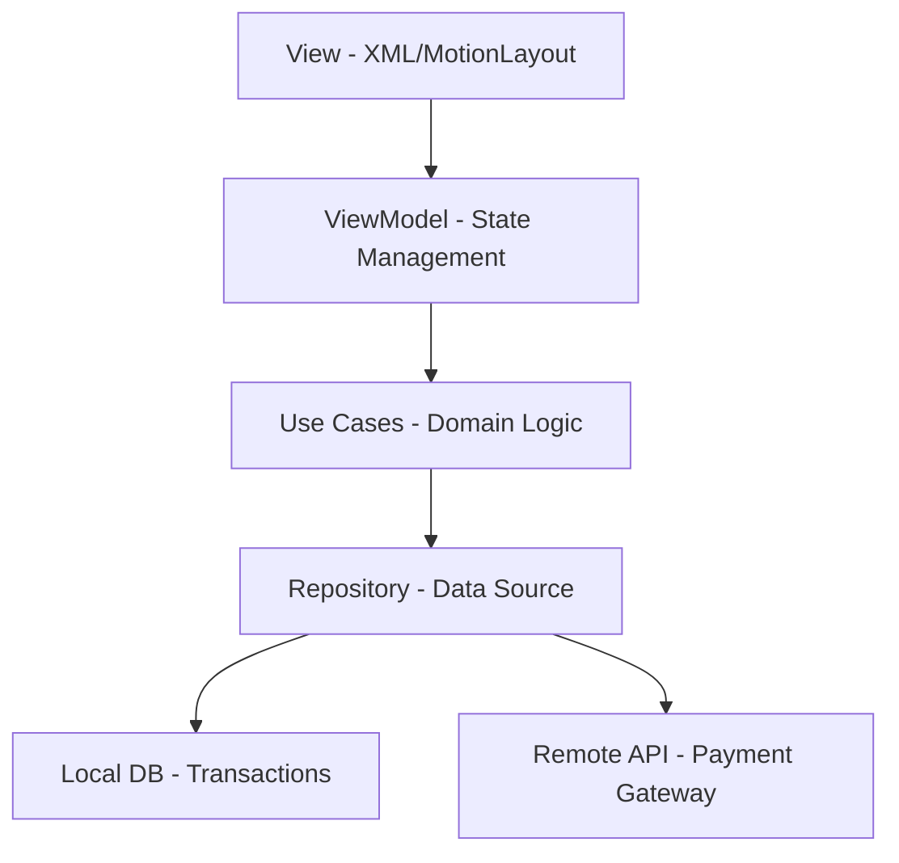

# 💳 KWalletPay - Premium Fintech Experience


**KWalletPay** is a state-of-the-art digital wallet application designed for the modern user. Combining elite fintech aesthetics with fluid motion design, it provides a seamless and secure payment experience.

---

## ✨ Features

- **💎 Elite Branding**: Modern "K-Flow" visual identity with high-contrast typography.
- **🍱 Bento Action Grid**: Intuitive 6-button layout for high-frequency tasks (Scan, Pay, Transfer).
- **🎭 Motion Engine**: Interactive `MotionLayout` transitions that react to user scroll and gestures.
- **👁️ One-Tap Privacy**: Dynamic "Check Balance" toggle integrated directly into the action dashboard.
- **📜 Smart History**: Collapsible transaction list with smooth rotation indicators.
- **🌅 Cinematic Splash**: High-end entrance animation featuring developer branding "From AKASH".

---

## 🏗️ Architecture

KWalletPay follows **Modern Android Development (MAD)** principles and **Clean Architecture** patterns to ensure scalability and performance.

### Architecture Graph



- **UI Layer**: Uses `MotionLayout` and `ConstraintLayout` for responsive, animated interfaces.
- **Logic Layer**: Kotlin-first approach with lifecycle-aware components.
- **Presentation**: "Bento Grid" design system for optimized information density.

---

## 🎨 Design Philosophy

### The Bento Grid Concept
Our dashboard utilizes a **Bento Grid** layout, inspired by modern productivity apps. This allows for:
- **Prioritization**: High-priority actions (Scan QR) occupy prominent visual space.
- **Grouping**: Logical separation between primary and secondary payment functions.
- **Consistency**: Unified corner radii (24dp) and soft-shadow elevation (4dp - 6dp).

### Color Palette
| Color | Hex | Role |
| :--- | :--- | :--- |
| **Primary Indigo** | `#6366F1` | Brand Identity & CTA |
| **Vivid Violet** | `#A855F7` | Accents & Gradients |
| **Slate Gray** | `#F8FAFC` | Background Contrast |
| **Emerald Green** | `#10B981` | Success States |

---

## 📸 Screenshots

| Splash Screen | Main Dashboard | History Toggle |
| :---: | :---: | :---: |
|  |  |  |

---

## 🚀 Getting Started

1. **Clone the repository**
   ```bash
   git clone https://github.com/yourusername/KWalletPay.git
   ```
2. **Open in Android Studio** (Ladybug or newer recommended).
3. **Build and Run** on an emulator or physical device (API 24+).

---

## 🛠️ Tech Stack

- **UI**: Material Components 3, MotionLayout, Lottie.
- **Logic**: Kotlin Coroutines, Flow.
- **Build**: Gradle KTS.
- **Design**: XML-based custom vector drawables.

---

## 👨‍💻 Developed By

**AKASH**
*Crafting premium digital experiences through code and design.*

---

© 2024 KWalletPay. All rights reserved.